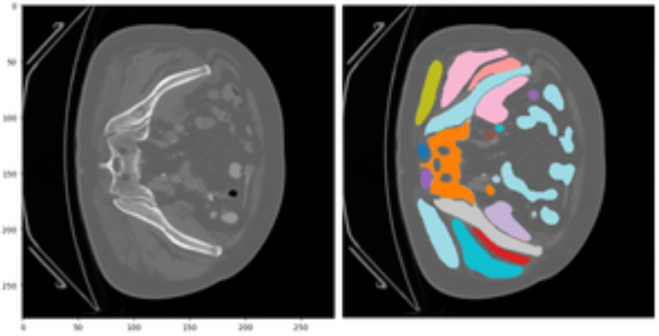
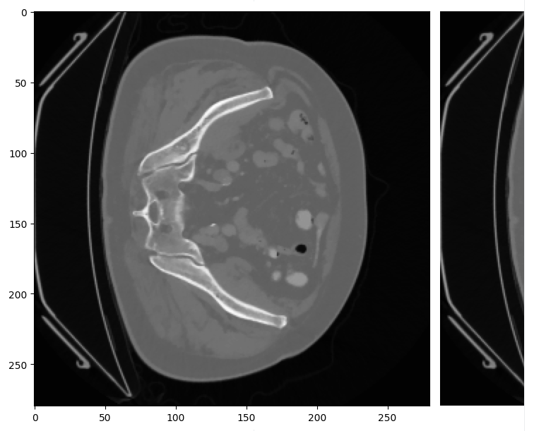

## Contexte

Les CT-scans offrent des images 3D très précises du corps humain (jusqu'à 0,5 mm de résolution) et permettent ainsi de saisir l'anatomie humaine. L'objectif de ce challenge est de segmenter automatiquement les structures anatomiques du corps humain, ainsi que les tumeurs, sur un CT-scan, sans identifier sémantiquement les organes associés. Autrement dit, il s'agit d'identifier les formes visibles sur un CT-scan. Ce problème de découverte d'objets est un problème intuitif et simple pour un humain, qui saura très simplement identifier de nouveaux objets sur une scène, et même sur un CT-scan, même s'il n'a jamais vu cet objet auparavant. Sur l'image ci-dessous, d'un CT-scan abdominal, les différentes structures ont été segmentées :



Alors que les algorithmes de segmentation supervisés de ces structures individuelles sont maintenant considérés comme résolus, il n'est pas possible d'utiliser l'apprentissage supervisé pour généraliser à de nouvelles structures anatomiques non vues auparavant.

## But

Le but de ce challenge est de segmenter les structures en utilisant leur forme, mais sans annotations exhaustives. Les données d'entraînement sont composées de deux types d'images :

- Des images de CT-scanner avec des masques de segmentation anatomiques de structures individuelles et des tumeurs. Elles agissent comme la définition de vérité terrain de ce qu'est une structure anatomique. Cependant, elles ne sont pas censées être représentatives de toutes les structures possibles et leur diversité, mais peuvent toujours être utilisées comme matériau d'entraînement. Cela fait de ce problème un mélange d'un problème d'apprentissage hors sujet (certaines structures dans l'ensemble de test ne sont pas présentes dans l'ensemble d'entraînement) et un problème d'apprentissage à peu d'exemples (certaines structures sont communes entre l'ensemble d'entraînement et l'ensemble de test, mais il y a peu d'exemples).
- Des images de CT-scanner brutes, sans aucune structure segmentée. Elles peuvent être utilisées comme matériau d'entraînement supplémentaire, dans le cadre d'un entraînement non supervisé.

Le jeu de test est composé d'images nouvelles avec leurs structures segmentées correspondantes, et la métrique mesure la capacité à correctement segmenter et séparer les différentes structures sur une image.

> **Note:** Les structures segmentées ne couvrent pas l'intégralité de l'image, certains pixels ne faisant pas partie d'une structure identifiable, comme nous le voyons sur l'image ci-dessus. Ils sont donc considérés comme faisant partie du fond.

## Description des données

L'entrée est une liste d'images 2D (i.e. un numpy array 3D) en niveaux de gris, chacune correspondant à une slice d'un CT-scan (dans le plan transversal) de taille 512x512 pixels; Les slices sont mélangées et il n'y a donc aucune information 3D. La sortie est une liste de matrices 2D (i.e. un numpy array 3D) de taille 512x512 avec des valeurs entières (uint8). Chaque position (w,h) de chaque matrice $Y_{i,w,h}$ identifie une structure.

Par exemple sur l'image ci-dessous : 



Les 23 couleurs correspondent à 23 structures segmentées différentes, ainsi chaque pixel label $Y_{i,w,h}$ à la position (w,h) a des valeurs dans l'intervalle [[0; 23]]. 0 est une valeur spéciale signifiant que ce pixel ne fait pas partie d'une structure et fait donc partie du fond.

En pratique, la sortie est encodée sous la forme d'un fichier CSV qui encode la transposée de la matrice de labels flatten. Note: La transposée est utilisée ici pour des raisons de performance: Pandas est très lent pour charger des fichiers CSV avec de nombreuses colonnes, mais est très rapide pour charger des fichiers CSV avec de nombreuses lignes. Ainsi, le CSV est composé de 262144 colonnes, chacune correspondant à un pixel de l'image, et 500 lignes, chacune correspondant à une image.

Pour obtenir la liste des matrices 2D, il faut donc transposer le CSV reçu, récupérer la ligne correspondante et la reshaper:

```python
import pandas as pd
predictions = pd.read_csv(label_csv_path, index_col=0, header=0).T[image_index].values.reshape((512, 512))
# A la fin, nous obtenons une liste de predictions 2D, soit un array numpy 3D de taille (500, 512, 512)
```

De même, pour obtenir le CSV d'output à partir d'une liste de prédictions 2D, il est nécessaire de flatten chacunes des predictions et les concaténer en une seule matrice, puis de transposer la matrice et enfin de la sauvegarder dans un fichier CSV:

```python
import pandas as pd
# predictions est une liste de predictions 2D, soit un array numpy 3D de taille (500, 512, 512)
predictions = np.array of [prediction_1, prediction_2, prediction_3, ...]
pd.DataFrame(predictions.reshape((predictions.shape[0], -1))).T.to_csv(output_csv_path)
```

Ce problème peut être vu comme un problème de clustering de pixels image par image, où chaque structure est un cluster dans l'image. L'identifiant d'une structure sur une image n'aura pas nécessairement le même numéro. Par exemple, la structure associée au foie peut être mappée sur le label 4 sur une image et sur 1 sur une autre image.

L'ensemble d'entraînement est composé de 2000 images, divisées en deux groupes:

- 400 avec des structures entièrement segmentées. Pour ces images, la sortie correspondante est une matrice 2D avec des étiquettes de pixels pour les structures et les tumeurs segmentées, et les autres pixels sont définis sur 0.
- 1600 d'entre elles n'ont aucune annotation du tout. Pour ces images, la sortie correspondante est une matrice 2D remplie de zéros.

> **Note:** Des segmentations des structures, sous la forme d'images (en plus du CSV) du jeu d'entraînement sont données dans les supplementary materials.

L'ensemble de test est composé de 500 images avec les structures segmentées. Pour ces images, le label est une matrice 2D avec les structures segmentées, et les pixels du fond valent 0. En considérant le fait qu'une image individuelle avec sa matrice de label est d'environ 400KB, et que nous avons 1500 images, nous avons alors un ensemble de données d'environ 600MB au total.

> **Note:** La segmentation map n'est pas dense, c'est-à-dire que certains pixels entre des structures ne font pas partie de structures segmentées, comme on peut le voir sur l'image ci-dessus. Ces pixels sont considérés comme faisant partie du fond.

> **Note:** L'usage de données d'entraînement radiologiques supplémentaires, de modèles pré-entraînés sur des données radiologiques, ou toute autre source de données radiologiques externe n'est pas autorisé. La seule source de données radiologique autorisée est l'ensemble d'entraînement et de test fourni par les organisateurs. Vous êtes toutefois autorisés à utiliser des données et modèles externes non radiologiques (DINO v2, SAM ...).

La métrique finale est calculée en moyennant l'indice de Rand entre chaque label et sa prédiction associée, tout en excluant les pixels de fond (c'est-à-dire 0 dans le label). Cette métrique de clustering est invariante à la permutation inter-image du numéro de structure et est implémentée dans sklearn ici.

## Notebook

Un notebook explicatif peut être trouvé à l'adresse suivante:

[Notebook explicatif](https://colab.research.google.com/drive/1OOzMtT62OFl_tURo4TWjFKJf6jRMc5_O?usp=share_link)

Il comprend notamment des exemples de chargement des données, de visualisation, et de calcul de la métrique et une baseline.

## Description du benchmark

Le benchmark se base sur des algorithmes classiques de vision, tels que watershed, filtres de sobel, etc.